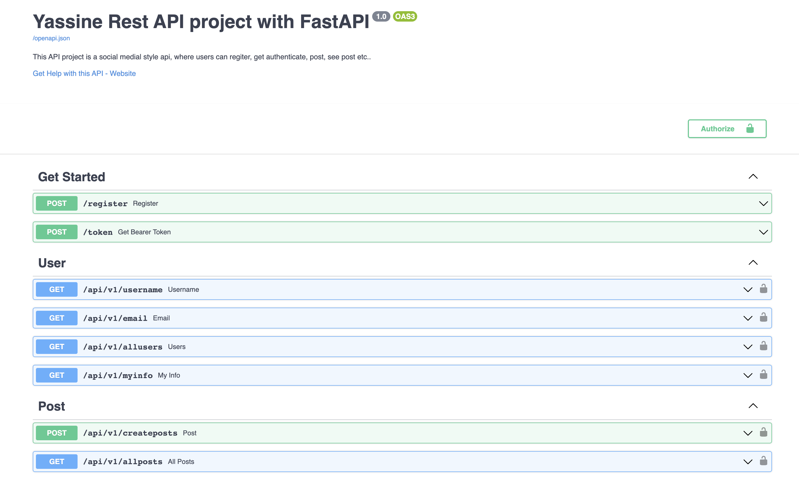

# Rest API using [FastAPI](https://fastapi.tiangolo.com/)

I recently came across FastAPI, a really cool fast (high-performance) modern  web framework for building APIs with Python 3.7+ based on standard Python type hints, the coolest part of FastAPI is the automatic interactive API documentation.

Example of the auto docs:


## Project details
This project is the FastAPI version of the flask one i made [here](https://github.com/fulanii/rest-api-project), it's a Social Media style RestAPI, where a user can register, authenticate, post and see all other posts. 


### Project Structure
```bash

fastapi_project/
| app/
|     __init__.py
|     main.py
|     dependencies.py
|     security.py
|     utils.py
|
|   routers/
|     __init__.py
|     posts.py 
|     users.py 
|     no_oaauth.py
| 
|   db/ 
|      __init__.py
|      crud.py
|      database.py
|      models.py
|      schemas.py
| 
| requirements.txt
| db.db
| run.py
|
```

### Project Demo


### Run locally